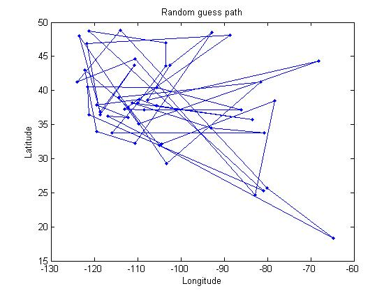
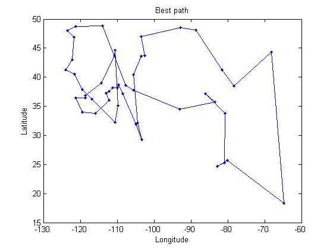

### Planning a route across all US National Parks by evolutionary algorithm

In abstract, this is an attempt to solve Travellng Salesman Problem (TSP) by using evolutionary algorithm. The source is written in C. To improve the performance, the implementation relies MPI to achiveve parallel computing.

To give the problem a context, I collected the coordinates of all mainlain US National Parks, and used them as the locations for the problem. After 30 min computation, we can start to see some acceptable results.

A random route (**before** optimization using evolutionary algorithm):

**After** optimization for 30 min:
